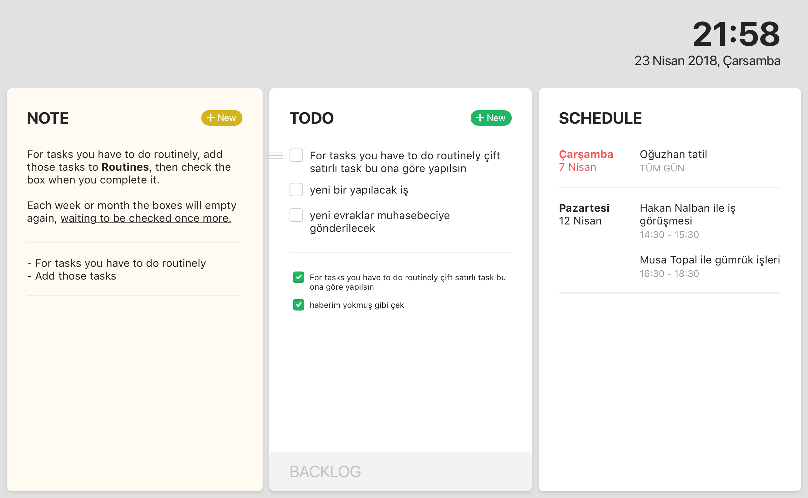

# Frame

New-tab extension for Chrome and Firefox



## Install

- [**Chrome** extension](https://chrome.google.com/webstore/detail/frame/pimalalkfhkmnlhoapdlhilkghboiimc)
- [**Firefox** extension](https://addons.mozilla.org/tr/firefox/addon/new-tab-frame/)

## Contribute

Suggestions and pull requests are highly encouraged!

In order to make modifications to the extension you'd need to run it locally.

Please follow the below steps:

```sh
git clone https://github.com/ademilter/frame
cd frame
yarn    # Install dev dependencies
yarn serve  # Listen for file changes and automatically rebuild
yarn build:chrome  # Build the extension code so it's ready for Chrome
yarn build:firefox  # Build the extension code so it's ready for Firefox
```

## Maintainers

- [Adem ilter](https://github.com/ademilter)
- [Nazım Can Altınova](https://github.com/canaltinova)

## License

MIT
